# FINCrime Files
> An analysis of the released data on FinCrime Files transactions as depicted on the Suspicious Activity Reports (SARs)

## The Heroes
> After months of painstaking investigations into leaked classified financial intelligence reports, [Buzzfeed News](‘https://www.buzzfeednews.com/article/jasonleopold/fincen-files-financial-scandal-criminal-networks’) and [The International Consortium of Investigative Journalists (‘ICIJ’)](‘https://www.icij.org/investigations/fincen-files/about-the-fincen-files-investigation/’) published in September 2020 their findings on how banks worldwide continued to launder money for drug cartels, crook politicians and so on. As this news gathered attention, it also came at no surprise to many working in this industry.

## So, what is this report all about?

> Sometime last year, ICIJ and Buzzfeed received secret financial intelligence reports known as the [Suspicious Activity Report (‘SAR’).](‘https://legal.thomsonreuters.com/en/insights/articles/what-is-a-suspicious-activity-report#:~:text=Suspicious%20activity%20reports%20are%20a,report%20suspicious%20activity%20in%201996.’) The SAR is a document that must be filed with the Financial Crimes Enforcement Network (‘FINCEN’) by financial institutions (‘FIs’) and their business associates whenever there is a suspicion of money laundering or fraud.

> Each country has its own version of FINCEN and the criteria to filing one varies from country to country but generally any financial transactions that appear suspicious and/or unusual should be alerted to the authority within 30 days from discovery.

> The criteria to filing one varies from country to country but generally any financial transactions that appear suspicious and/or unusual. In 1996, the **Bank Secrecy Act (1970)** began requiring FIs to submit SARS then eventually incorporated further requirements as imposed by the **USA Patriot Act** after the September 9/11, to combat domestic and global terrorism.

> So, when a government agency receives SARs, they are supposed to investigate the claims and create policies to better how FIs could combat money laundering.

## So, what did the leaked SARs say about this?

> According to ICIJ and Buzzfeed, their investigations revealed that [‘the global investigation by more than 400 journalists reveals how banks continue to move dirty money for drug cartels, corrupt regimes, arms traffickers and other international criminals — and how a broken U.S.-led enforcement system perpetuates business as usual.’](‘https://www.icij.org/investigations/fincen-files/about-the-fincen-files-investigation/’) The journalists involved managed to categorically discover how banks helped to hide money looted from government treasuries (recall, IMDB?), earned through illicit means and other criminal activities.

> When I read this news, I got excited. Because ICIJ released the [dataset](‘https://www.icij.org/investigations/fincen-files/download-fincen-files-transaction-data/’) they had compiled throughout the investigations. I buckled down and got on to analyse the dataset and found some interesting patterns. I will not be writing the full detail of the analysis but just a few important ones.

> Throughout this project, I have used **Python** and **SQL** on **Jupyter Notebook**. For visualisation, I have used **Matplotlib** and **Seaborn**, and **Tableau** as its dashboard.

## Let's explore the data - FinCrime Files data

> As stated earlier, ICIJ has the data published on their website for anyone to use. The data contains a small portion of information from the 2100 SARs submitted by FIs and consists of two datasets. The transaction dataset contains information not only on the number and total amount of transactions each bank has facilitated but also the origins and the beneficiaries of the monies. Each transaction has the begin and end dates which help to understand duration of each suspicious activity.

> The second dataset contains information on the banks'connection to the transactions. For further information on the variables, please go to the [notebook]('**ADD LINK**') which contains all code work.

> Henceforth, the transaction dataset will be refereed as **dataset1** and the connection dataset as **dataset2** for brevity. All amount quoted in the datasets is in the <ins>US dollars</ins>.

### The Basics

 > I began my analysis by first getting the basics right. Dataset1 has a total of <ins>5498</ins> observations (rows) and <ins>16</ins> variables (columns) while the second dataset has <ins>4507</ins> observations and <ins>7</ins> variables. There are 123 observations with _none_ value and it means that these details were not on the SARs. A total of 119 countries were identified in the data.

 > Where do most transactions lie? The table shown below tells us that the maximum total amount is about 2.7 billion dollars! I have gone through the datasets to where and when it happened. More on this later.

 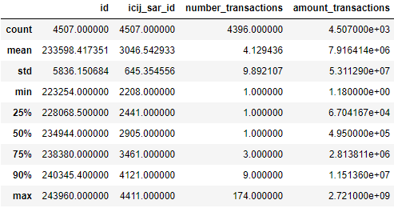  
***Table 1***

> The histogram below shows a nearly normal distribution of transactions. The data looks very slightly skewed to the left. As you can see the median is higher than the mean as shown in the table 1.

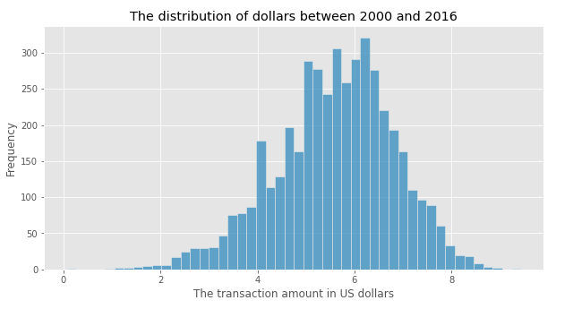

## So, who is the top filer?
*#DRUM ROLLS#*
> The top filer is **The Bank of New York Mellon Group.** A whopping <ins>3442</ins>, that is **76.4%**! To that into perspective the volume, the 2nd top filer only filed <ins>376</ins> SARs, which is 8.3%, as shown in the visual below.

 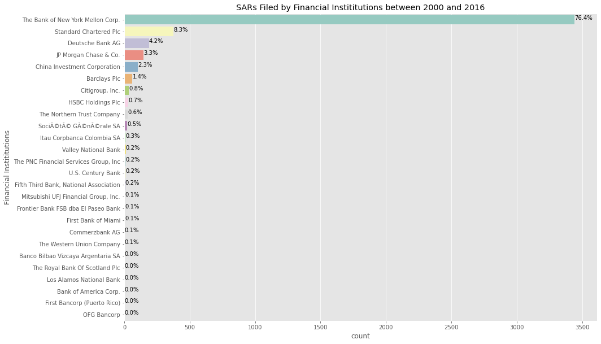

## Where to and from did the money go?

> Next, I wanted to focus on the countries instead of the banks. I wanted to know who scored the highest for having mostly namely in the SARs. I picked the top 20. As you can see, most <ins>**transactions**</ins> originated in Latvia and Russia. These individual transactions transacted between 2004 and 2017.

 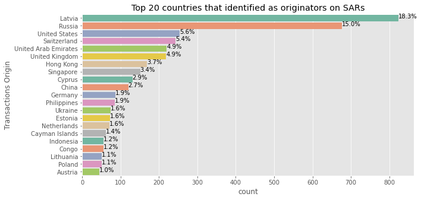

> I did the same to the <ins>**beneficiaries**</ins>. I chose top 20. As shown below, the most count went to Latvia, Russia and Switzerland.

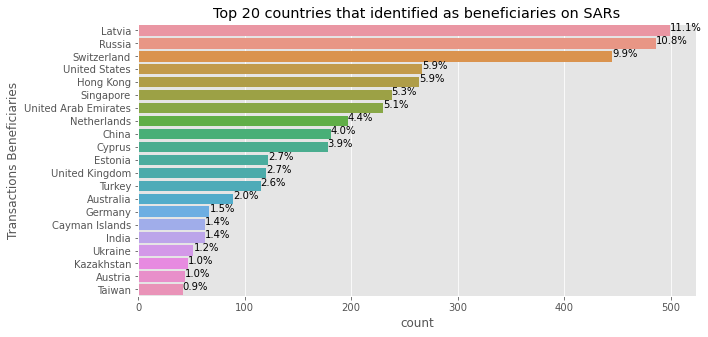

## What about the transactions themselves?

> Refer to the chart below. I used SQL to split the datasets into three. The top originator dataset has information of countries that were indicated the most in the SARs as originators and I wanted to know how much money in total left these countries.

> Hence, the second dataset which is the top amount. The latter dataset instead shows the highest total amount filed in the SARs. So I have plotted the two on one graph to see the difference in the amounts. And then I have added the third dataset in the same plot to see how it would fare against the other two. The top beneficiary dataset is about the total amount of money that had left the countries that have been indicated the most in the SARs as the beneficiaries.

> The result? The highest total amount is about USD 2.7 billion that was transferred once in one day from Amsterdam Trade Bank NV, Netherlands to Rosbank in Russia. But one look at the chart tells us that the amount is only about a half of the highest total amount sent from Latvia. Latvia had a total of 2256 transactions totaling to a grand total of about 6 Billion dollars.

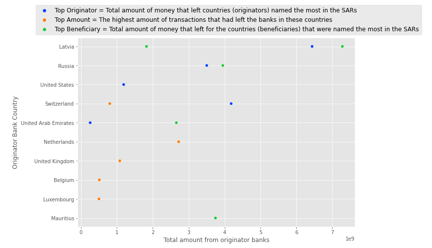  
***Top Originator vs Top Beneficiaries vs Top Amount***

## So, how much money really?
> **About 32 BILLION dollars between 2000 and 2017 (August)!**. I have further broken down the transactions into their denominations as you can see in the chart below. There are two transactions in the billions. And most transactions involved the millions.

 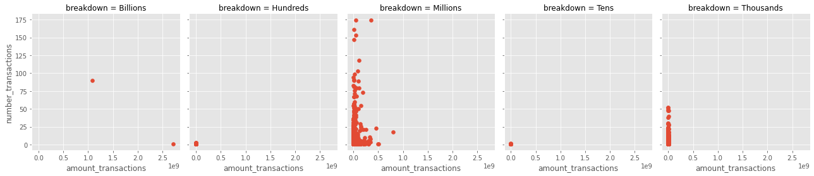

> But I wanted to see the spread amongst the lower denominations. Charts below show just that. All denominations were plotted against the number of transactions.

 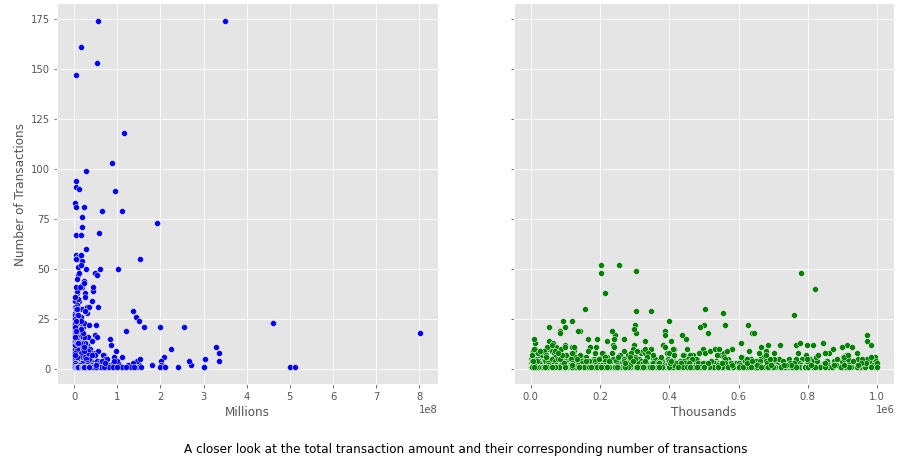  
***The distributions in millions and thousands***

> As seen in charts above and below, the range in the transactions involving the  <ins>thousands</ins> but almost all have fewer than 25 transactions. Interestingly enough the transactions of <ins> hundreds</ins> and <ins>tens</ins> involved one transaction.

 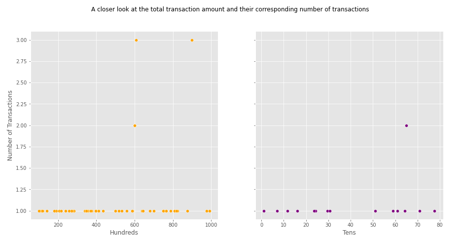  
***The distributions in thousands and tens***

## Next...
### What's up with the entity banks? Who are they?
> As mentioned above, dataset2 contains the correspondent banking information and it connected to the dataset1 in which it shows relationship between the bank and the transaction. According to ICIJ, the relationship in dataset2 is always **between a US-based bank and another bank**.  

> That relationship is marked at **entity banks**. What are these banks? The entity banks have correspondent account in a US bank. This is the proper definition:
>> "Correspondent banks provide services as agents for other financial institutions, typically acting on their behalf in other countries where the financial institutions don’t or can’t operate. Correspondent banks handle **wire transfers, take deposits, collect local documentation, conduct transactions, and perform other tasks**. When a bank serving a local business has wide correspondent banking relationships, it’s easier for that business to serve global customers and use far-flung supply chain partners."  
>> _Source: https://www.americanexpress.com/us/foreign-exchange/articles/decline-correspondent-banking-solutions/_

> It is best to explain the transactions using an example. See table 2 below. This money was transacted from Afghanistan to Indonesia and believed to have occurred 5 times in 22 days in 2016. This data is from dataset1.

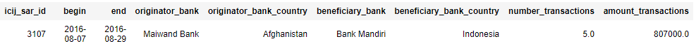
***Table 2***

> I then merged datasets 1 and 2 to see if there was any connection between the two datasets. The table 3 below is the result. So what happened here?

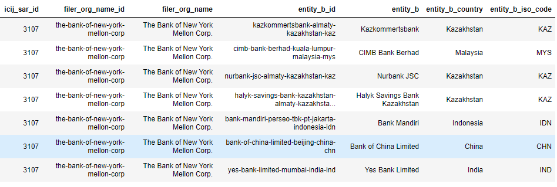
***Table 3***

> Now take a look at table 3. The five transactions that left Afghanistan to Indonesia believed to have happened via the entity banks listed therein.

> I spoke to a colleague and she suspects these transactions depicted above (*and there are many more in the datasets*) may have occurred through [nested accounts]('https://finance.zacks.com/nesting-banking-10754.html').

> In this case, the banks listed as entity banks in Table 3 have correspondent accounts maintained in the US bank, **The Bank of New York Mellon Corp**. Each of these entity banks has allowed transaction from **Malwand Bank** in Afghanistan to **Bank Mandiri** in Indonesia. This is what they called as <ins>**nesting in banking**</ins>. A correspondent account becomes a nested account when these entity banks permit another FI -- Malwand -- access to the correspondent account, in some cases facilitating money launders to launder their illicit gains.

> In general, nested accounts are legal and compliant with the law. But there are risks associated with these accounts as seen in the example above.

# Conclusion
> I found some more interesting discoveries which work in in the Jupyter Notebook.

> Before I began this analysis, I had questions about the data. How much money had traveled around and which countries had benefited and lost the most? How did low and high income fared?

> When I compared the visuals on originators and beneficiaries, especially on the grand sum of money that transacted, the top performers tend to be those in the developed countries.

> I am thinking that someone in Africa with huge amount of money to launder could potentially pick one of these countries (or safe havens) to park their income away from the rightful owners--the people.

> Financial crime runs in [trillions]('https://www.linkedin.com/pulse/cost-financial-crime-surge-above-145-trillion-2019-che-sidanius'). The system clearly is not working efficiently.  We can have all the tools and software to filter people and monies. How does one tackle or revamp a system when banks operate on a profit-based business?
